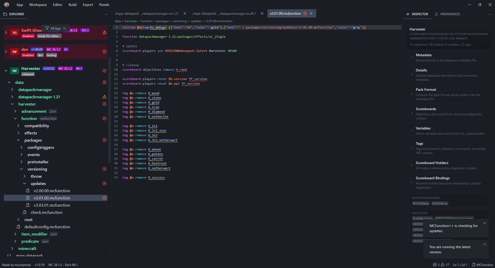

# MCFunction++

### The IDE for building, validating, and shipping Minecraft datapacks.

Write commands faster with smart autocomplete, catch mistakes before they hit the game with live diagnostics, and package release-ready datapacks — all in one desktop app.

**[⬇️ Download the latest release](https://github.com/Portyl-Studios/MCFunctionPlusPlus/releases/latest)**

---

## Why MCFunction++

Authoring Minecraft datapacks usually means juggling a plain text editor, the wiki, and trial-and-error reloads in-game. MCFunction++ pulls the whole loop into one place: a real editor that understands `.mcfunction` syntax, tells you when a command is wrong, and packages your work when you're done.

## Features

- **Purpose-built `.mcfunction` editor** — full syntax highlighting for Minecraft commands via a custom CodeMirror 6 language, not a generic text mode.
- **Smart, context-aware autocomplete** — suggestions for commands, subcommands, selectors, objectives, scoreboard slots, and more, driven by the actual command schema for your target version.
- **Live diagnostics** — inline linting and context-aware error checking catch invalid commands and arguments as you type, before you ever load the world.
- **Automatic Minecraft data preparation** — point at a version and the app downloads and generates the command/schema data for you. No manual `server.jar` extraction or report wrangling.
- **Datapack inspector & project navigation** — browse your workspace and datapack structure with dedicated file and datapack trees, plus an inspector panel.
- **Built-in themes** — ships with Portyl Dark, Dracula, Material Dark, and Material Light.
- **Workspaces & file associations** — organize multiple datapacks in a workspace; double-click `.mpp-workspace` and `.mpp-datapack` files to open them straight in the app.
- **One-click packaging & auto-update** — produce a release-ready datapack and keep the app current automatically through GitHub Releases.

> [!TODO]
> _Add a short GIF for each headline feature (autocomplete firing, live error squiggles, automatic data prep progress). Place them under `assets/screenshots/` and embed inline next to the matching bullet._

## Download & Install

1. Go to the **[latest release](https://github.com/Portyl-Studios/MCFunctionPlusPlus/releases/latest)**.
2. Download `mcfunctionplusplus-setup-<version>.exe`.
3. Run the installer and pick your install directory.
4. Launch MCFunction++.

The app updates itself on launch when a new release is available.

## Requirements

MCFunction++ needs **Java 26+** at runtime to prepare Minecraft command data. It's auto-detected from your system `PATH`; if you'd rather point at a specific runtime, set an explicit Java path in app preferences.

Java setup details (PATH vs. explicit path)

**Option A — use `java` from PATH (recommended).** Leave Java Path empty in preferences; the app resolves and validates `java` from your `PATH`.

**Option B — explicit executable.** Set Java Path to a full path such as `C:\Program Files\Java\jdk-26\bin\java.exe`.

**Quick PATH setup on Windows:**

1. Install a JDK (e.g. to `C:\Program Files\Java\jdk-26`).
2. Open *Edit the system environment variables* → *Environment Variables…*.
3. Under *System variables*, add `JAVA_HOME` = `C:\Program Files\Java\jdk-26`.
4. Edit `Path` and add `%JAVA_HOME%\bin`.
5. Open a new terminal and run `java --version` to confirm.

If `java --version` fails, fix `PATH`/`JAVA_HOME`, or use Option B with an explicit `java.exe` path.

> ℹ️ MCFunction++ is currently distributed for **Windows** (NSIS installer). macOS and Linux builds are not officially supported yet.

## Roadmap

- **Web app** — a lightweight browser version sharing the desktop core. Planned once the desktop app is fully featured; not yet available.
- macOS and Linux distribution.

Have a feature in mind? [Open an issue](https://github.com/Portyl-Studios/MCFunctionPlusPlus/issues).

## Contributing

MCFunction++ is open source and contributions are welcome. Build instructions, the release pipeline, and asset specs live in **[CONTRIBUTING.md](CONTRIBUTING.md)**.

If the project saves you time, please ⭐ **[star the repo](https://github.com/Portyl-Studios/MCFunctionPlusPlus)** — it genuinely helps.

## License

Licensed under **[GPLv3](LICENSE)**. Derived works must also be open source and GPLv3-licensed.

---

Built by <strong>Portyl Studios</strong>

